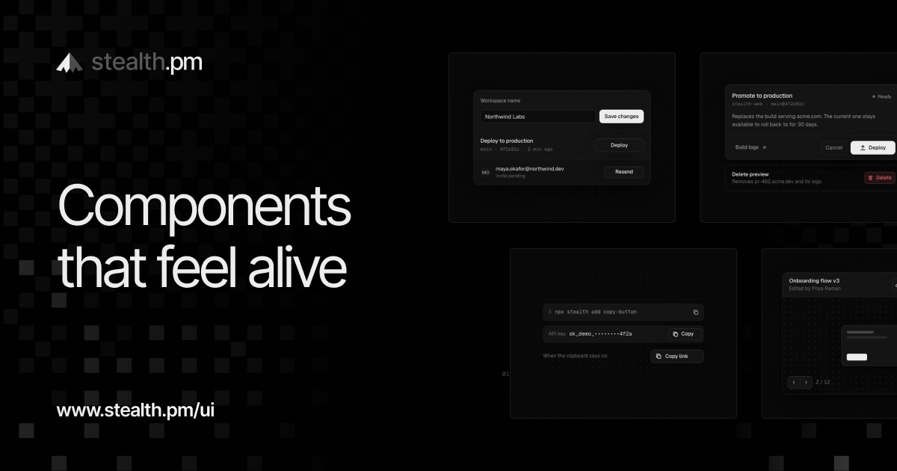

<a href="https://www.stealth.pm/ui"></a>

# Stealth UI

321 React components for product interfaces, each one finished: every state, the keyboard, the screen reader, touch, both themes, reduced motion, and the small motion that tells you something happened.

Not a package. You copy the source into your project and it becomes yours. Start a new app with all of it, add one component to an app you have, or copy a file by hand.

```bash
npx create-next-app@latest my-app -e https://github.com/paragonhq/stealth-ui
```

Browse every component working, with its props and notes, at **[stealth.pm/ui](https://www.stealth.pm/ui)**.

## Why

Most component libraries stop at "it renders". The button has no pressed state, the menu pops in from nowhere, the spinner makes the button shrink, the dialog forgets where focus was, and nothing works with reduced motion on. None of that fails a test. All of it is why software feels generated.

Every component here was built against one contract and checked in both themes, at phone width and with reduced motion before it was called done. Accessible behaviour comes from [Base UI](https://base-ui.com) primitives where the pattern has one. Motion runs on [Motion](https://motion.dev) with one set of curves and springs. Styling is Tailwind v4 on a small set of tokens.

## Get started

### A new project

The repo is a Next.js starter with every component already in `components/ui`, its example in `components/examples`, and a gallery at `/` to browse them.

```bash
npx create-next-app@latest my-app -e https://github.com/paragonhq/stealth-ui
cd my-app
npm run dev
```

Or take a clean copy without git history:

```bash
npx degit paragonhq/stealth-ui my-app
```

Delete `app/page.tsx`, `app/c` and `components/examples` once you start building. The components don't depend on them.

### An existing project

You need React 19, Tailwind CSS v4 and the `@/*` path alias. Components install through the [shadcn CLI](https://ui.shadcn.com/docs/cli), which copies the file, its shared helpers and its npm dependencies.

1. Add the tokens and import them after Tailwind in your global CSS:

   ```bash
   npx shadcn@latest add https://www.stealth.pm/r/tokens.json
   ```

   ```css
   @import "tailwindcss";
   @import "../styles/stealth.css";
   ```

2. Add a component:

   ```bash
   npx shadcn@latest add https://www.stealth.pm/r/copy-button.json
   ```

3. Or all 321 at once:

   ```bash
   npx shadcn@latest add https://www.stealth.pm/r/all.json
   ```

To use short names, add the registry to your `components.json`:

```json
{
  "registries": {
    "@stealth": "https://www.stealth.pm/r/{name}.json"
  }
}
```

```bash
npx shadcn@latest add @stealth/copy-button @stealth/dialog @stealth/toast
```

### By hand

Every component is one file in [`components/ui`](components/ui). Copy it, copy the helpers it imports from [`lib`](lib) (`cn`, `motion`, `icons`, `use-controllable-state`), copy [`styles/stealth.css`](styles/stealth.css), and install the packages it imports.

## Dependencies

| Package | For |
| --- | --- |
| `react` 19 | Everything |
| `motion` | Springs, layout animation, gestures, presence |
| `@base-ui/react` | Focus, keyboard and ARIA for dialogs, menus, selects, sliders, tabs and the rest |
| `@floating-ui/react` | Anchoring things Base UI has no part for, like a toolbar on a text selection |
| `@number-flow/react` | Digits that roll instead of fading |
| `sugar-high` | Syntax highlighting in the code components |
| `tailwindcss` 4 | Styling, on the tokens in `styles/stealth.css` |

Each component only pulls in what it imports. There is no date, chart, drag or icon library.

## Tokens

`styles/stealth.css` defines everything the components read: warm near-black and off-white surfaces (`page`, `frame`, `raised`, `hover`), two line weights, four text steps, semantic colours used only for meaning (`danger`, `success`, `warning`, `info` and their soft versions), two shadows, easing curves (`ease-out-expo`, `ease-in-out-quart`, `ease-drawer`), a z-index scale, and a few keyframes. It is dark by default. Set `data-theme="light"` on `<html>` for light, or change the values to make it yours.

## The components

### Actions

Buttons that acknowledge the press and report what happened.

| Component | What it does |
| --- | --- |
| [**Async Button**](components/ui/async-button.tsx) | Tracks the promise it starts: busy, tick or retry, without ever changing width. [Docs](https://www.stealth.pm/ui/async-button) |
| [**Button**](components/ui/button.tsx) | Four variants, three sizes, and a loading state that never changes width. [Docs](https://www.stealth.pm/ui/button) |
| [**Button Group**](components/ui/button-group.tsx) | Attached buttons with hairlines between and one hover wash that glides. [Docs](https://www.stealth.pm/ui/button-group) |
| [**Copy Button**](components/ui/copy-button.tsx) | Copies on press, draws a tick, holds its width and reverts on its own. [Docs](https://www.stealth.pm/ui/copy-button) |
| [**Hold to Confirm**](components/ui/hold-to-confirm.tsx) | Press and hold to commit; the label flips color under the filling edge. [Docs](https://www.stealth.pm/ui/hold-to-confirm) |
| [**Icon Button**](components/ui/icon-button.tsx) | Square button with a required label, warm tooltips and a sprung squash. [Docs](https://www.stealth.pm/ui/icon-button) |
| [**Like Button**](components/ui/like-button.tsx) | Optimistic like with a squash-and-stretch heart, rolling count and honest rollback. [Docs](https://www.stealth.pm/ui/like-button) |
| [**Speed Dial**](components/ui/speed-dial.tsx) | A floating button that fans out labeled actions, nearest first, on a spring. [Docs](https://www.stealth.pm/ui/speed-dial) |
| [**Split Button**](components/ui/split-button.tsx) | Main action plus a chevron menu; the choice can become the main action. [Docs](https://www.stealth.pm/ui/split-button) |
| [**Toggle Button**](components/ui/toggle-button.tsx) | Stays on with aria-pressed, and its icon morphs: fills, pins, mutes. [Docs](https://www.stealth.pm/ui/toggle-button) |
| [**Toggle Group**](components/ui/toggle-group.tsx) | Single or multiple toggles; one wash slides, neighboring washes join. [Docs](https://www.stealth.pm/ui/toggle-group) |
| [**Two-step Confirm**](components/ui/two-step-confirm.tsx) | Asks once in place, springs to fit the question, then quietly takes it back. [Docs](https://www.stealth.pm/ui/two-step-confirm) |

### Text inputs

Fields for typing, with every state accounted for.

| Component | What it does |
| --- | --- |
| [**Floating Label Field**](components/ui/floating-label.tsx) | Label rests inside as the placeholder and floats up on focus, value or autofill. [Docs](https://www.stealth.pm/ui/floating-label) |
| [**Inline Edit**](components/ui/inline-edit.tsx) | Text that becomes an input in place, saves optimistically, then draws a tick. [Docs](https://www.stealth.pm/ui/inline-edit) |
| [**Input**](components/ui/input.tsx) | Text field with prefix and suffix slots, a clear that fades in, and Field-aware invalid state. [Docs](https://www.stealth.pm/ui/input) |
| [**Masked Input**](components/ui/masked-input.tsx) | Formats cards, phones, dates and money as you type, caret held in place. [Docs](https://www.stealth.pm/ui/masked-input) |
| [**Mention Input**](components/ui/mention-input.tsx) | A textarea where @ suggests people at the caret and names become tokens. [Docs](https://www.stealth.pm/ui/mention-input) |
| [**Number Field**](components/ui/number-field.tsx) | Steppers you can hold, a label you can drag, digits that roll into place. [Docs](https://www.stealth.pm/ui/number-field) |
| [**OTP Field**](components/ui/otp-field.tsx) | Six cells that take paste and autofill, ripple while checking, clear on failure. [Docs](https://www.stealth.pm/ui/otp-field) |
| [**Password Field**](components/ui/password-field.tsx) | Reveals with an eye that slashes itself, keeps the caret, warns on Caps Lock. [Docs](https://www.stealth.pm/ui/password-field) |
| [**Password Strength**](components/ui/password-strength.tsx) | Four bars that fill in order, a checklist that ticks, a settled announcement. [Docs](https://www.stealth.pm/ui/password-strength) |
| [**Search Field**](components/ui/search-field.tsx) | Search box whose shortcut hint turns into a clear, with a patient spinner. [Docs](https://www.stealth.pm/ui/search-field) |
| [**Tag Input**](components/ui/tag-input.tsx) | Chips from Enter, comma or paste; duplicates flash the one already there. [Docs](https://www.stealth.pm/ui/tag-input) |
| [**Textarea**](components/ui/textarea.tsx) | Grows with its text between row limits, counts near the limit, sends on ⌘↵. [Docs](https://www.stealth.pm/ui/textarea) |

### Selection

Checks, radios, switches and chips that feel physical.

| Component | What it does |
| --- | --- |
| [**Checkbox**](components/ui/checkbox.tsx) | Draws its tick, bends it into a dash when mixed, squashes on press. [Docs](https://www.stealth.pm/ui/checkbox) |
| [**Checkbox Card**](components/ui/checkbox-card.tsx) | Selectable cards whose corner check pops in, with a select-all that counts. [Docs](https://www.stealth.pm/ui/checkbox-card) |
| [**Checklist**](components/ui/checklist.tsx) | Tasks that strike through, then glide into Completed, with a rolling count. [Docs](https://www.stealth.pm/ui/checklist) |
| [**Choice Chips**](components/ui/choice-chips.tsx) | Filter chips whose check grows the chip open, with rolling counts and clear. [Docs](https://www.stealth.pm/ui/choice-chips) |
| [**Color Swatches**](components/ui/color-swatches.tsx) | Swatch radio group with a ring that grows out and a contrast-aware check. [Docs](https://www.stealth.pm/ui/color-swatches) |
| [**Radio Cards**](components/ui/radio-card.tsx) | Plan-style cards where one selection ring slides to whichever you choose. [Docs](https://www.stealth.pm/ui/radio-card) |
| [**Radio Group**](components/ui/radio-group.tsx) | One choice from a few, with a dot that springs in and arrow-key roving. [Docs](https://www.stealth.pm/ui/radio-group) |
| [**Rating**](components/ui/rating.tsx) | Star rating with hover preview, half steps, scrubbing and a pop on commit. [Docs](https://www.stealth.pm/ui/rating) |
| [**Segmented Control**](components/ui/segmented-control.tsx) | One pill that springs between segments, with radio semantics and arrow keys. [Docs](https://www.stealth.pm/ui/segmented-control) |
| [**Switch**](components/ui/switch.tsx) | Sprung thumb that stretches while held, and waits on async saves in place. [Docs](https://www.stealth.pm/ui/switch) |
| [**Thumbs Feedback**](components/ui/thumbs-feedback.tsx) | Helpful or not, with reasons on a thumbs down and a drawn thanks. [Docs](https://www.stealth.pm/ui/thumbs-feedback) |

### Sliders & dials

Continuous values, dragged, stepped and scrubbed.

| Component | What it does |
| --- | --- |
| [**Detent Slider**](components/ui/detent-slider.tsx) | Named stops you can feel: resists near each one, springs into place. [Docs](https://www.stealth.pm/ui/detent-slider) |
| [**Dial**](components/ui/dial.tsx) | Rotary knob with drag, wheel and keys, a bipolar arc and rolling readout. [Docs](https://www.stealth.pm/ui/dial) |
| [**Histogram Range**](components/ui/histogram-range.tsx) | Price filter whose bars light up exactly between the thumbs as they move. [Docs](https://www.stealth.pm/ui/histogram-range) |
| [**Media Scrubber**](components/ui/media-scrubber.tsx) | Seek bar with chapters, buffered ranges and a time tip that tracks the pointer. [Docs](https://www.stealth.pm/ui/media-scrubber) |
| [**Range Slider**](components/ui/range-slider.tsx) | Two thumbs whose labels merge when close, synced with typed min and max. [Docs](https://www.stealth.pm/ui/range-slider) |
| [**Slider**](components/ui/slider.tsx) | Thumb swells on grab, value rides above it, pressed track glides. [Docs](https://www.stealth.pm/ui/slider) |
| [**Volume Control**](components/ui/volume-control.tsx) | Speaker waves follow the level; mute remembers, wheel nudges, popover tucks away. [Docs](https://www.stealth.pm/ui/volume-control) |
| [**Zoom Control**](components/ui/zoom-control.tsx) | Minus, rolling percentage and plus, with a type-or-pick menu and pinch zoom. [Docs](https://www.stealth.pm/ui/zoom-control) |

### Pickers

Choosing one or many from a list that can get long.

| Component | What it does |
| --- | --- |
| [**Async Combobox**](components/ui/async-combobox.tsx) | Remote search that debounces, aborts stale requests and never jolts the list. [Docs](https://www.stealth.pm/ui/async-combobox) |
| [**Cascader**](components/ui/cascader.tsx) | Nested columns that grow in beside each other, with search across every path. [Docs](https://www.stealth.pm/ui/cascader) |
| [**Color Picker**](components/ui/color-picker.tsx) | Drag, type or sample a color; hue survives grays and recents remember. [Docs](https://www.stealth.pm/ui/color-picker) |
| [**Combobox**](components/ui/combobox.tsx) | Filters as you type, sets the matched run in bold and creates what’s missing. [Docs](https://www.stealth.pm/ui/combobox) |
| [**Emoji Picker**](components/ui/emoji-picker.tsx) | Search-first emoji grid with arrow keys, skin tones and categories that follow the scroll. [Docs](https://www.stealth.pm/ui/emoji-picker) |
| [**Listbox**](components/ui/listbox.tsx) | An inline list where the choice slides between rows and picks merge into blocks. [Docs](https://www.stealth.pm/ui/listbox) |
| [**Multi Select**](components/ui/multi-select.tsx) | Chips that fit the field with a rolling +N, search, select all and clear. [Docs](https://www.stealth.pm/ui/multi-select) |
| [**Phone Field**](components/ui/phone-field.tsx) | Formats as you type for the chosen country, and reads it from pasted numbers. [Docs](https://www.stealth.pm/ui/phone-field) |
| [**Select**](components/ui/select.tsx) | Opens over its trigger with the choice aligned, and the new value slides in from where it was picked. [Docs](https://www.stealth.pm/ui/select) |
| [**Transfer List**](components/ui/transfer-list.tsx) | Two filterable lists where checked rows fly across and land highlighted. [Docs](https://www.stealth.pm/ui/transfer-list) |

### Dates & time

Calendars, fields and clocks that read like the locale.

| Component | What it does |
| --- | --- |
| [**Calendar**](components/ui/calendar.tsx) | Locale-true month grid that slides the way you travel and sweeps ranges in. [Docs](https://www.stealth.pm/ui/calendar) |
| [**Countdown**](components/ui/countdown.tsx) | Rolling-digit countdown that sleeps off screen and lands in an ended state. [Docs](https://www.stealth.pm/ui/countdown) |
| [**Date Field**](components/ui/date-field.tsx) | Typed date in the locale's order, with stepping digits and plain-word errors. [Docs](https://www.stealth.pm/ui/date-field) |
| [**Date Picker**](components/ui/date-picker.tsx) | Type “next fri” or pick from the calendar; it reads back before committing. [Docs](https://www.stealth.pm/ui/date-picker) |
| [**Date Range Picker**](components/ui/date-range-picker.tsx) | Two months, presets that sweep the range in, and a draft until Apply. [Docs](https://www.stealth.pm/ui/date-range-picker) |
| [**Relative Time**](components/ui/relative-time.tsx) | “3 minutes ago” that wakes only when its words change, digits rolling. [Docs](https://www.stealth.pm/ui/relative-time) |
| [**Time Picker**](components/ui/time-picker.tsx) | Segmented time field in the locale's order, with rolling digits and a slot list. [Docs](https://www.stealth.pm/ui/time-picker) |
| [**Week Strip**](components/ui/week-strip.tsx) | Phone-style day selector with a sprung pill, swipeable weeks and event dots. [Docs](https://www.stealth.pm/ui/week-strip) |

### Scheduling

Calendars full of events, slots and availability.

| Component | What it does |
| --- | --- |
| [**Agenda**](components/ui/agenda.tsx) | Upcoming events by day with a Now line and a Join that counts down. [Docs](https://www.stealth.pm/ui/agenda) |
| [**Availability Editor**](components/ui/availability-editor.tsx) | Weekly hours with split shifts, copy to other days and overlap checks. [Docs](https://www.stealth.pm/ui/availability-editor) |
| [**Booking Slots**](components/ui/booking-slots.tsx) | Pick a day, then a time that splits in place to reveal Confirm. [Docs](https://www.stealth.pm/ui/booking-slots) |
| [**Event Calendar**](components/ui/event-calendar.tsx) | Month view that packs multi-day bars and chips into lanes, overflowing into a day list. [Docs](https://www.stealth.pm/ui/event-calendar) |
| [**Timezone Select**](components/ui/timezone-select.tsx) | Every IANA zone with live local time, searchable by city, name or offset. [Docs](https://www.stealth.pm/ui/timezone-select) |
| [**Week Grid**](components/ui/week-grid.tsx) | Time grid where overlaps sit side by side and you drag to create, move or resize. [Docs](https://www.stealth.pm/ui/week-grid) |

### Forms

Validation, uploads and saving without losing work.

| Component | What it does |
| --- | --- |
| [**Autosave Status**](components/ui/autosave-status.tsx) | Saving, saved, offline and failed states in one pill that springs to fit. [Docs](https://www.stealth.pm/ui/autosave-status) |
| [**Avatar Upload**](components/ui/avatar-upload.tsx) | Pick, crop and zoom a photo, then watch a ring close around it. [Docs](https://www.stealth.pm/ui/avatar-upload) |
| [**Character Limit Ring**](components/ui/char-limit-ring.tsx) | A tiny ring that fills as you type, then counts down and over. [Docs](https://www.stealth.pm/ui/char-limit-ring) |
| [**Dropzone**](components/ui/dropzone.tsx) | Lights up when files cross the window, seals its dashes, names every rejection. [Docs](https://www.stealth.pm/ui/dropzone) |
| [**Error Summary**](components/ui/error-summary.tsx) | Lists every problem on submit, links to each field, and thins out as you fix. [Docs](https://www.stealth.pm/ui/error-summary) |
| [**Field**](components/ui/field.tsx) | Label, control, hint and error that speak up on blur, not on every keystroke. [Docs](https://www.stealth.pm/ui/field) |
| [**Inline Validation**](components/ui/inline-validation.tsx) | Async checks that spin, then draw a tick or strike a cross, without flicker. [Docs](https://www.stealth.pm/ui/inline-validation) |
| [**Multi-step Form**](components/ui/multi-step-form.tsx) | Steps slide the way you travel, validate one at a time, and keep every answer. [Docs](https://www.stealth.pm/ui/multi-step-form) |
| [**Save Bar**](components/ui/save-bar.tsx) | Rises when a form is dirty, nudges before you leave, ticks once saved. [Docs](https://www.stealth.pm/ui/save-bar) |
| [**Signature Pad**](components/ui/signature-pad.tsx) | Smooth, speed-weighted ink with undo, a typed alternative and trimmed PNG/SVG export. [Docs](https://www.stealth.pm/ui/signature-pad) |
| [**Upload List**](components/ui/upload-list.tsx) | Per-file progress with smoothed speed and time left, retry, and a tick on finish. [Docs](https://www.stealth.pm/ui/upload-list) |

### Loading & progress

What the screen does while it waits, and when it fails.

| Component | What it does |
| --- | --- |
| [**Empty State**](components/ui/empty-state.tsx) | One line, one reason, one action, with an icon that draws itself in. [Docs](https://www.stealth.pm/ui/empty-state) |
| [**Error State**](components/ui/error-state.tsx) | Says what failed and what to do, retries in place, counts every attempt. [Docs](https://www.stealth.pm/ui/error-state) |
| [**Infinite List**](components/ui/infinite-list.tsx) | A scrolling feed that prefetches pages under skeletons and recovers from failures. [Docs](https://www.stealth.pm/ui/infinite-list) |
| [**Load More**](components/ui/load-more.tsx) | Appends the next page with a stagger, moves focus and never jumps. [Docs](https://www.stealth.pm/ui/load-more) |
| [**Progress Bar**](components/ui/progress-bar.tsx) | Rolling percentage, buffer, stepped segments and a tick that draws on completion. [Docs](https://www.stealth.pm/ui/progress-bar) |
| [**Progress Ring**](components/ui/progress-ring.tsx) | Circular progress with a rolling percentage that closes into a drawn tick. [Docs](https://www.stealth.pm/ui/progress-ring) |
| [**Pull to Refresh**](components/ui/pull-to-refresh.tsx) | Rubber-band pull with a filling ring, a flipping arrow and a sprung return. [Docs](https://www.stealth.pm/ui/pull-to-refresh) |
| [**Skeleton**](components/ui/skeleton.tsx) | Bones sized to your text’s line box, lit by one shared slow sweep. [Docs](https://www.stealth.pm/ui/skeleton) |
| [**Skeleton Swap**](components/ui/skeleton-swap.tsx) | Skeleton to content with a 4px settle and clearing blur, never a flash. [Docs](https://www.stealth.pm/ui/skeleton-swap) |
| [**Spinner**](components/ui/spinner.tsx) | Arc, dots and pixel-grid spinners drawn on the icon grid, so they swap for icons. [Docs](https://www.stealth.pm/ui/spinner) |
| [**Task Steps**](components/ui/task-steps.tsx) | Stages of a long job with live timers, drawn checks and a filling rail. [Docs](https://www.stealth.pm/ui/task-steps) |
| [**Top Loader**](components/ui/top-loader.tsx) | A thin page bar that trickles, finishes fast and fades; skips fast loads. [Docs](https://www.stealth.pm/ui/top-loader) |

### Notifications

Telling people something changed without shouting.

| Component | What it does |
| --- | --- |
| [**Announcement Bar**](components/ui/announcement-bar.tsx) | Slim top bar that rotates messages, holds while read and can be paused. [Docs](https://www.stealth.pm/ui/announcement-bar) |
| [**Banner**](components/ui/banner.tsx) | Region-wide notice that collapses smoothly when dismissed and can remember it. [Docs](https://www.stealth.pm/ui/banner) |
| [**Callout**](components/ui/callout.tsx) | Inline note, tip, warning or danger block with details that unfold in place. [Docs](https://www.stealth.pm/ui/callout) |
| [**Connection Status**](components/ui/connection-status.tsx) | Offline, reconnecting and back-online in one pill that morphs between them. [Docs](https://www.stealth.pm/ui/connection-status) |
| [**Cookie Consent**](components/ui/cookie-consent.tsx) | Compact consent card with equal choices and categories that unfold in place. [Docs](https://www.stealth.pm/ui/cookie-consent) |
| [**Count Badge**](components/ui/count-badge.tsx) | A count that rolls its digits, pops when it rises and caps at 99+. [Docs](https://www.stealth.pm/ui/count-badge) |
| [**Dynamic Island**](components/ui/dynamic-island.tsx) | A live-activity pill that springs open into controls and morphs between activities. [Docs](https://www.stealth.pm/ui/dynamic-island) |
| [**New Items Pill**](components/ui/new-items-pill.tsx) | Holds new feed items behind a rolling count until the reader asks for them. [Docs](https://www.stealth.pm/ui/new-items-pill) |
| [**Notification Inbox**](components/ui/notification-inbox.tsx) | A bell that rings on arrival and opens a grouped, keyboard-driven inbox with undo. [Docs](https://www.stealth.pm/ui/notification-inbox) |
| [**Promise Toast**](components/ui/promise-toast.tsx) | One toast follows async work: spinner, live progress, then a tick drawn in place. [Docs](https://www.stealth.pm/ui/promise-toast) |
| [**Status Dot**](components/ui/status-dot.tsx) | Presence dot whose shape morphs between states, so color is never the only signal. [Docs](https://www.stealth.pm/ui/status-dot) |
| [**Toast**](components/ui/toast.tsx) | Stacked toasts that fan out on hover, swipe away and update in place. [Docs](https://www.stealth.pm/ui/toast) |

### Dialogs & sheets

Surfaces that open over the page and give focus back.

| Component | What it does |
| --- | --- |
| [**Alert Dialog**](components/ui/alert-dialog.tsx) | Destructive confirm that holds open while it works and explains failures in place. [Docs](https://www.stealth.pm/ui/alert-dialog) |
| [**Bottom Sheet**](components/ui/bottom-sheet.tsx) | Drag between peek, half and full; the list scrolls only once it's open. [Docs](https://www.stealth.pm/ui/bottom-sheet) |
| [**Dialog**](components/ui/dialog.tsx) | Rises from .97 on the expo curve, scrolls inside with edge hairlines, nudges when refused. [Docs](https://www.stealth.pm/ui/dialog) |
| [**Hover Card**](components/ui/hover-card.tsx) | Profile and link previews that prefetch on intent and draw the wait. [Docs](https://www.stealth.pm/ui/hover-card) |
| [**Morph Dialog**](components/ui/morph-dialog.tsx) | A card that opens into its dialog and folds back into the grid. [Docs](https://www.stealth.pm/ui/morph-dialog) |
| [**Morph Popover**](components/ui/morph-popover.tsx) | A button that grows into its own form and folds back into a tick. [Docs](https://www.stealth.pm/ui/morph-popover) |
| [**Popover**](components/ui/popover.tsx) | Grows out of its trigger along a seamless arrow, flips at edges, opens on hover. [Docs](https://www.stealth.pm/ui/popover) |
| [**Sheet**](components/ui/sheet.tsx) | Side panel on the drawer curve that swipes away and resizes with give. [Docs](https://www.stealth.pm/ui/sheet) |
| [**Stacked Dialog**](components/ui/stacked-dialog.tsx) | Each dialog opened from another pushes it back, dimmed, with a way back. [Docs](https://www.stealth.pm/ui/stacked-dialog) |

### Menus & tooltips

Actions tucked behind a trigger, found in one move.

| Component | What it does |
| --- | --- |
| [**Action Sheet**](components/ui/action-sheet.tsx) | Rises from the bottom, swipes away, and holds for slow actions. [Docs](https://www.stealth.pm/ui/action-sheet) |
| [**Context Menu**](components/ui/context-menu.tsx) | Opens at the pointer on right-click, long-press or Shift+F10. [Docs](https://www.stealth.pm/ui/context-menu) |
| [**Dropdown Menu**](components/ui/dropdown-menu.tsx) | Grows from its trigger, with one highlight that glides after the pointer. [Docs](https://www.stealth.pm/ui/dropdown-menu) |
| [**Menubar**](components/ui/menubar.tsx) | File, Edit, View menus with one pill that slides between them. [Docs](https://www.stealth.pm/ui/menubar) |
| [**Overflow Menu**](components/ui/overflow-menu.tsx) | Folds the least important controls into More as it narrows, by priority. [Docs](https://www.stealth.pm/ui/overflow-menu) |
| [**Popconfirm**](components/ui/popconfirm.tsx) | Asks where you pressed, starts on Cancel, and waits out async confirms. [Docs](https://www.stealth.pm/ui/popconfirm) |
| [**Row Actions**](components/ui/row-actions.tsx) | Quick actions slide in over the row's meta, the rest wait in a menu. [Docs](https://www.stealth.pm/ui/row-actions) |
| [**Selection Toolbar**](components/ui/selection-toolbar.tsx) | Rises over selected text, glides as it changes, and morphs into a link field. [Docs](https://www.stealth.pm/ui/selection-toolbar) |
| [**Tooltip**](components/ui/tooltip.tsx) | Waits once, then answers neighbors instantly, or glides one tooltip along a toolbar. [Docs](https://www.stealth.pm/ui/tooltip) |

### Command & search

Keyboard-first finding, filtering and jumping.

| Component | What it does |
| --- | --- |
| [**Active Filters**](components/ui/active-filters.tsx) | Applied filters as removable chips that close ranks, fold to +N and undo. [Docs](https://www.stealth.pm/ui/active-filters) |
| [**Command Pages**](components/ui/command-pages.tsx) | Palette pages that slide in, land on the current choice and remember the way back. [Docs](https://www.stealth.pm/ui/command-pages) |
| [**Command Palette**](components/ui/command-palette.tsx) | ⌘K opens it on the same frame, ranks matches and runs async commands in place. [Docs](https://www.stealth.pm/ui/command-palette) |
| [**Faceted Filter**](components/ui/faceted-filter.tsx) | A filter button whose searchable popover ticks values, counts roll, chips collapse to +N. [Docs](https://www.stealth.pm/ui/faceted-filter) |
| [**Filter Builder**](components/ui/filter-builder.tsx) | Filters written as sentences, each word a dropdown, with an all-or-any switch. [Docs](https://www.stealth.pm/ui/filter-builder) |
| [**Highlight Match**](components/ui/highlight-match.tsx) | Marks what matched in search results, accent-blind, with fuzzy mode and snippets. [Docs](https://www.stealth.pm/ui/highlight-match) |
| [**Kbd**](components/ui/kbd.tsx) | Keys written for the reader's platform that press down with the real ones. [Docs](https://www.stealth.pm/ui/kbd) |
| [**Scoped Search**](components/ui/scoped-search.tsx) | A search field where from: and in: become tokens with value suggestions. [Docs](https://www.stealth.pm/ui/scoped-search) |
| [**Search Dialog**](components/ui/search-dialog.tsx) | Async search with filter counts that roll, a live preview and stale-safe loading. [Docs](https://www.stealth.pm/ui/search-dialog) |
| [**Shortcuts Sheet**](components/ui/shortcuts-sheet.tsx) | Press ? for every shortcut; press any shortcut and its row lights up. [Docs](https://www.stealth.pm/ui/shortcuts-sheet) |

### Page navigation

Moving through the parts of one page or flow.

| Component | What it does |
| --- | --- |
| [**Animated Link**](components/ui/animated-link.tsx) | Inline link whose underline draws in, retracts ahead and rewinds when interrupted. [Docs](https://www.stealth.pm/ui/animated-link) |
| [**Breadcrumbs**](components/ui/breadcrumbs.tsx) | A trail that folds its middle into a menu to fit its width. [Docs](https://www.stealth.pm/ui/breadcrumbs) |
| [**Page Dots**](components/ui/page-dots.tsx) | Carousel dots whose active pill stretches, fills with autoplay time and scrolls when long. [Docs](https://www.stealth.pm/ui/page-dots) |
| [**Pagination**](components/ui/pagination.tsx) | Numbered pages with a sliding pill, a rolling range and a steady width. [Docs](https://www.stealth.pm/ui/pagination) |
| [**Stepper**](components/ui/stepper.tsx) | Wizard steps whose numbers draw into ticks as the rail fills. [Docs](https://www.stealth.pm/ui/stepper) |
| [**Sub Nav**](components/ui/sub-nav.tsx) | Scrolling link strip with a gliding hover pill, edge fades and arrows. [Docs](https://www.stealth.pm/ui/sub-nav) |
| [**Tabs**](components/ui/tabs.tsx) | Sliding underline or pill, panels that crossfade and glide to height. [Docs](https://www.stealth.pm/ui/tabs) |
| [**Table of Contents**](components/ui/toc.tsx) | Scroll-spy contents whose rail steps with nesting and fills as you read. [Docs](https://www.stealth.pm/ui/toc) |
| [**Tree View**](components/ui/tree-view.tsx) | A file tree that opens by height, lights its branch and types ahead. [Docs](https://www.stealth.pm/ui/tree-view) |
| [**Vertical Tabs**](components/ui/vertical-tabs.tsx) | Settings-style side list with a gliding highlight that folds into a select. [Docs](https://www.stealth.pm/ui/vertical-tabs) |

### App navigation

Shells, sidebars and switchers that frame a product.

| Component | What it does |
| --- | --- |
| [**Icon Rail**](components/ui/icon-rail.tsx) | Sidebar that folds to icons in place, with tooltips only when narrow. [Docs](https://www.stealth.pm/ui/icon-rail) |
| [**Mega Menu**](components/ui/mega-menu.tsx) | Site menu with one panel that morphs between triggers and slides content. [Docs](https://www.stealth.pm/ui/mega-menu) |
| [**Mobile Menu**](components/ui/mobile-menu.tsx) | Phone menu whose burger turns into the close, with sections that drill in. [Docs](https://www.stealth.pm/ui/mobile-menu) |
| [**Navbar**](components/ui/navbar.tsx) | Top bar that compacts on scroll while a pill follows the pointer home. [Docs](https://www.stealth.pm/ui/navbar) |
| [**Path Switcher**](components/ui/path-switcher.tsx) | Team / project breadcrumb where every step is a searchable switcher that eases. [Docs](https://www.stealth.pm/ui/path-switcher) |
| [**Resizable Panels**](components/ui/resizable-panels.tsx) | Split panes that drag, resist at their limits and spring shut on double-click. [Docs](https://www.stealth.pm/ui/resizable-panels) |
| [**Sidebar**](components/ui/sidebar.tsx) | App sidebar whose active pill springs between rows and whose counts roll. [Docs](https://www.stealth.pm/ui/sidebar) |
| [**Tab Bar**](components/ui/tab-bar.tsx) | Phone bottom navigation whose icons fill when active, with rolling badge counts. [Docs](https://www.stealth.pm/ui/tab-bar) |
| [**User Menu**](components/ui/user-menu.tsx) | Avatar menu with presence, a sliding theme control and a sign-out that waits. [Docs](https://www.stealth.pm/ui/user-menu) |
| [**Workspace Switcher**](components/ui/workspace-switcher.tsx) | Searchable workspace menu with number shortcuts, pending switches and a rolling trigger. [Docs](https://www.stealth.pm/ui/workspace-switcher) |

### Disclosure

Showing more on request, and putting it back.

| Component | What it does |
| --- | --- |
| [**Accordion**](components/ui/accordion.tsx) | Stacked sections that grow to fit, with answers find-in-page can still reach. [Docs](https://www.stealth.pm/ui/accordion) |
| [**Collapsible**](components/ui/collapsible.tsx) | One section that folds away, plus a Show 3 more list that cascades in. [Docs](https://www.stealth.pm/ui/collapsible) |
| [**Expandable Card**](components/ui/expandable-card.tsx) | Cards that open in place to show details while the others make room. [Docs](https://www.stealth.pm/ui/expandable-card) |
| [**Interactive Card**](components/ui/interactive-card.tsx) | The whole card is one link, while buttons inside still get their own clicks. [Docs](https://www.stealth.pm/ui/interactive-card) |
| [**Scroll Area**](components/ui/scroll-area.tsx) | Native scrolling with thin overlay bars and edges that fade in as you scroll. [Docs](https://www.stealth.pm/ui/scroll-area) |
| [**Show More**](components/ui/show-more.tsx) | Clamps long text with a fading last line, offering more only when it overflows. [Docs](https://www.stealth.pm/ui/show-more) |

### Scroll

Headers, progress and reveals tied to the scroll position.

| Component | What it does |
| --- | --- |
| [**Back to Top**](components/ui/back-to-top.tsx) | Arrives after a screen, rings with progress, and hands focus back at the top. [Docs](https://www.stealth.pm/ui/back-to-top) |
| [**Hide on Scroll**](components/ui/hide-on-scroll.tsx) | Steps aside while you read down, returns on a deliberate scroll up. [Docs](https://www.stealth.pm/ui/hide-on-scroll) |
| [**Overflow Scroller**](components/ui/overflow-scroller.tsx) | A horizontal row whose edge fades and arrows appear only where content hides. [Docs](https://www.stealth.pm/ui/overflow-scroller) |
| [**Reading Progress**](components/ui/reading-progress.tsx) | Tracks the article, not the page, and counts the minutes down. [Docs](https://www.stealth.pm/ui/reading-progress) |
| [**Scroll Reveal**](components/ui/scroll-reveal.tsx) | Reveals children once as they scroll in, with a capped stagger that never replays. [Docs](https://www.stealth.pm/ui/scroll-reveal) |
| [**Scroll Shadow**](components/ui/scroll-shadow.tsx) | Shades only the edges with more to scroll, tied to the scroll itself. [Docs](https://www.stealth.pm/ui/scroll-shadow) |
| [**Snap Carousel**](components/ui/snap-carousel.tsx) | Native scroll-snap carousel with sprung paging, mouse drag and dots that follow the scroll. [Docs](https://www.stealth.pm/ui/snap-carousel) |
| [**Stacking Cards**](components/ui/stacking-cards.tsx) | Cards that stick and stack as you scroll, the ones behind shrinking and dimming. [Docs](https://www.stealth.pm/ui/stacking-cards) |
| [**Sticky Header**](components/ui/sticky-header.tsx) | Invisible at rest, gains its edge and blur once content slides beneath. [Docs](https://www.stealth.pm/ui/sticky-header) |
| [**Virtual List**](components/ui/virtual-list.tsx) | A windowed listbox for 10,000 rows with measured heights and sticky group headers. [Docs](https://www.stealth.pm/ui/virtual-list) |

### Tables

Dense rows people sort, select, edit and act on.

| Component | What it does |
| --- | --- |
| [**Column Manager**](components/ui/column-manager.tsx) | Show, hide and drag columns into order while the table rearranges live. [Docs](https://www.stealth.pm/ui/column-manager) |
| [**Editable Cells**](components/ui/editable-cells.tsx) | Spreadsheet cells that edit in place, validate per cell and flash when saved. [Docs](https://www.stealth.pm/ui/editable-cells) |
| [**Expandable Rows**](components/ui/expandable-rows.tsx) | Rows open a detail panel that grows from beneath them and scrolls itself into view. [Docs](https://www.stealth.pm/ui/expandable-rows) |
| [**Filter Grid**](components/ui/filter-grid.tsx) | Card grid filtered by chips and search that reflows instead of reshuffling. [Docs](https://www.stealth.pm/ui/filter-grid) |
| [**Key-Value List**](components/ui/key-value-list.tsx) | Details-panel pairs with copy, in-place edit and a wash that marks what changed. [Docs](https://www.stealth.pm/ui/key-value-list) |
| [**Row Selection**](components/ui/row-selection.tsx) | Shift-click ranges that tick in sequence, and a bulk bar that rises with a rolling count. [Docs](https://www.stealth.pm/ui/row-selection) |
| [**Sortable Table**](components/ui/sortable-table.tsx) | Headers cycle through both directions and back, rows spring into their new order. [Docs](https://www.stealth.pm/ui/sortable-table) |
| [**Sticky Columns**](components/ui/sticky-columns.tsx) | Pinned columns, header and totals whose edges shade only while something hides beneath. [Docs](https://www.stealth.pm/ui/sticky-columns) |
| [**Table Pagination**](components/ui/table-pagination.tsx) | Rows per page, rolling range, jump to page, and rows that crossfade the way you paged. [Docs](https://www.stealth.pm/ui/table-pagination) |
| [**Table Toolbar**](components/ui/table-toolbar.tsx) | Search, filter, density, view and export in one arrow-key toolbar that reflows. [Docs](https://www.stealth.pm/ui/table-toolbar) |

### Numbers & charts

Values that change, and the shape of them over time.

| Component | What it does |
| --- | --- |
| [**Bar Chart**](components/ui/bar-chart.tsx) | Columns or ranked rows that grow in, morph on change and glide a tooltip. [Docs](https://www.stealth.pm/ui/bar-chart) |
| [**Contribution Graph**](components/ui/contribution-graph.tsx) | A year of daily activity as a keyboard-walkable heatmap with a gliding tooltip. [Docs](https://www.stealth.pm/ui/contribution-graph) |
| [**Delta Badge**](components/ui/delta-badge.tsx) | Signed change with one arrow that turns, tinted by whether the change is good. [Docs](https://www.stealth.pm/ui/delta-badge) |
| [**Donut Chart**](components/ui/donut-chart.tsx) | A gapped ring that sweeps in, lifts a segment and rolls its value. [Docs](https://www.stealth.pm/ui/donut-chart) |
| [**Leaderboard**](components/ui/leaderboard.tsx) | Ranked rows that spring into place, roll their scores and pin you. [Docs](https://www.stealth.pm/ui/leaderboard) |
| [**Line Chart**](components/ui/line-chart.tsx) | Multi-series lines with a snapping crosshair, full readout and a toggling legend. [Docs](https://www.stealth.pm/ui/line-chart) |
| [**Number Ticker**](components/ui/number-ticker.tsx) | Rolls each digit toward its new value in the direction it moved, tinting briefly. [Docs](https://www.stealth.pm/ui/number-ticker) |
| [**Poll Results**](components/ui/poll-results.tsx) | Tap to vote, then bars grow and counts roll up from zero. [Docs](https://www.stealth.pm/ui/poll-results) |
| [**Sparkline**](components/ui/sparkline.tsx) | A tiny trend line that draws in once and scrubs to any point. [Docs](https://www.stealth.pm/ui/sparkline) |
| [**Stat Tile**](components/ui/stat-tile.tsx) | KPI card whose sparkline you scrub to roll the headline to any day. [Docs](https://www.stealth.pm/ui/stat-tile) |
| [**Usage Meter**](components/ui/usage-meter.tsx) | Quota bar split by category that warns near the limit and shows overage honestly. [Docs](https://www.stealth.pm/ui/usage-meter) |
| [**Value Flash**](components/ui/value-flash.tsx) | Live value that washes green or red on each tick, throttled below three flashes a second. [Docs](https://www.stealth.pm/ui/value-flash) |

### Identity & display

Avatars, badges, tags and the small labels around them.

| Component | What it does |
| --- | --- |
| [**Avatar**](components/ui/avatar.tsx) | Photo that fades in once loaded, initials that never flash, presence that morphs. [Docs](https://www.stealth.pm/ui/avatar) |
| [**Avatar Group**](components/ui/avatar-group.tsx) | Overlapping faces with true cutouts that fan apart and open the full list. [Docs](https://www.stealth.pm/ui/avatar-group) |
| [**Badge**](components/ui/badge.tsx) | Status and count labels whose text, width and tone change in place. [Docs](https://www.stealth.pm/ui/badge) |
| [**Entity Chip**](components/ui/entity-chip.tsx) | Inline mention of a person, repo or issue with a lazy-loading hover card. [Docs](https://www.stealth.pm/ui/entity-chip) |
| [**Heading Anchor**](components/ui/heading-anchor.tsx) | A heading whose # link copies the section URL, ticks and marks the section. [Docs](https://www.stealth.pm/ui/heading-anchor) |
| [**Profile Card**](components/ui/profile-card.tsx) | A person with presence, local time and stats, and an optimistic follow that rolls back. [Docs](https://www.stealth.pm/ui/profile-card) |
| [**Tag**](components/ui/tag.tsx) | Removable chips that fold away, close the gap and hand focus on. [Docs](https://www.stealth.pm/ui/tag) |
| [**Timeline**](components/ui/timeline.tsx) | Activity grouped by day on a rail, where new events grow in at the top. [Docs](https://www.stealth.pm/ui/timeline) |

### Media

Images, video and audio, loaded and handled with care.

| Component | What it does |
| --- | --- |
| [**Audio Player**](components/ui/audio-player.tsx) | Compact player whose waveform fills as it plays, with drag-to-seek and speed. [Docs](https://www.stealth.pm/ui/audio-player) |
| [**Blur-up Image**](components/ui/blur-up-image.tsx) | Holds its space, then brings the full image into focus over a blurred preview. [Docs](https://www.stealth.pm/ui/blur-up-image) |
| [**File Thumbnail**](components/ui/file-thumbnail.tsx) | File card by type that keeps the extension visible and shows upload progress. [Docs](https://www.stealth.pm/ui/file-thumbnail) |
| [**Gallery Grid**](components/ui/gallery-grid.tsx) | Masonry photos that blur up, select like a photo app and glide when rearranged. [Docs](https://www.stealth.pm/ui/gallery-grid) |
| [**Image Compare**](components/ui/image-compare.tsx) | A before-and-after divider that follows a drag and springs to a click. [Docs](https://www.stealth.pm/ui/image-compare) |
| [**Image Cropper**](components/ui/image-cropper.tsx) | Crop box with handles, aspect presets, zoom and rotate, exported to a Blob. [Docs](https://www.stealth.pm/ui/image-cropper) |
| [**Lightbox**](components/ui/lightbox.tsx) | Photos lift out of their thumbnails, swipe between, zoom, and land back where they came from. [Docs](https://www.stealth.pm/ui/lightbox) |
| [**Product Gallery**](components/ui/product-gallery.tsx) | Product photos that crossfade on pick, swipe on touch and magnify under the mouse. [Docs](https://www.stealth.pm/ui/product-gallery) |
| [**Video Player**](components/ui/video-player.tsx) | Custom controls over native video, with chapters, subtitles and a morphing play button. [Docs](https://www.stealth.pm/ui/video-player) |
| [**Voice Recorder**](components/ui/voice-recorder.tsx) | Records with live input levels, pauses, and plays back before you send. [Docs](https://www.stealth.pm/ui/voice-recorder) |
| [**Zoom Pan Image**](components/ui/zoom-pan-image.tsx) | Pinch, wheel or double-click to zoom where you point, then throw it around. [Docs](https://www.stealth.pm/ui/zoom-pan-image) |

### Text & content

Type that arrives, changes and truncates gracefully.

| Component | What it does |
| --- | --- |
| [**Highlight**](components/ui/highlight.tsx) | A marker stroke drawn in reading order, carrying on across line breaks. [Docs](https://www.stealth.pm/ui/highlight) |
| [**Link Preview**](components/ui/link-preview.tsx) | Unfurled link card and inline hover preview sharing one cached request. [Docs](https://www.stealth.pm/ui/link-preview) |
| [**Marquee**](components/ui/marquee.tsx) | Seamless infinite row that eases to a stop under the pointer. [Docs](https://www.stealth.pm/ui/marquee) |
| [**Prose**](components/ui/prose.tsx) | Token-only typography for rendered rich text, with section links and code copy. [Docs](https://www.stealth.pm/ui/prose) |
| [**Spoiler**](components/ui/spoiler.tsx) | Grain-and-blur cover that dissolves outward from where you press it. [Docs](https://www.stealth.pm/ui/spoiler) |
| [**Text Morph**](components/ui/text-morph.tsx) | Shared letters slide into their new places while the width springs. [Docs](https://www.stealth.pm/ui/text-morph) |
| [**Text Reveal**](components/ui/text-reveal.tsx) | Words or wrapped lines lift out of a blur once, text left intact. [Docs](https://www.stealth.pm/ui/text-reveal) |
| [**Text Scramble**](components/ui/text-scramble.tsx) | Decodes left to right in fixed time, only where characters changed. [Docs](https://www.stealth.pm/ui/text-scramble) |
| [**Truncate**](components/ui/truncate.tsx) | Cuts text at the end or middle and unfolds it in place when cut. [Docs](https://www.stealth.pm/ui/truncate) |

### Gestures & drag

Things you pick up, throw, swipe and drop.

| Component | What it does |
| --- | --- |
| [**Drag Select**](components/ui/drag-select.tsx) | Rubber-band selection that scrolls at the edges and honors Shift and ⌘. [Docs](https://www.stealth.pm/ui/drag-select) |
| [**Drop Target**](components/ui/drop-target.tsx) | Targets say what they take, pull the item in and send refusals home. [Docs](https://www.stealth.pm/ui/drop-target) |
| [**Kanban**](components/ui/kanban.tsx) | Cards lean into the drag, land on an insertion line and move by menu too. [Docs](https://www.stealth.pm/ui/kanban) |
| [**Long Press**](components/ui/long-press.tsx) | Press and hold with a filling ring, right click and Shift F10 included. [Docs](https://www.stealth.pm/ui/long-press) |
| [**Pan Zoom Canvas**](components/ui/pan-zoom-canvas.tsx) | An infinite dot-grid canvas that pans, pinches and zooms to the cursor. [Docs](https://www.stealth.pm/ui/pan-zoom-canvas) |
| [**Reorder List**](components/ui/reorder-list.tsx) | Lifts on press, springs neighbors aside and reorders from the keyboard too. [Docs](https://www.stealth.pm/ui/reorder-list) |
| [**Resizable Box**](components/ui/resizable-box.tsx) | Eight handles, a live size readout, Shift for ratio, Alt from center. [Docs](https://www.stealth.pm/ui/resizable-box) |
| [**Sortable Grid**](components/ui/sortable-grid.tsx) | Tiles lift off the grid, leave a slot behind and land where dropped. [Docs](https://www.stealth.pm/ui/sortable-grid) |
| [**Swipe Actions**](components/ui/swipe-actions.tsx) | Swipe a row to reveal actions; swipe far and the tray fills to commit. [Docs](https://www.stealth.pm/ui/swipe-actions) |
| [**Swipe Deck**](components/ui/swipe-deck.tsx) | A card stack you throw left or right, with undo and matching buttons. [Docs](https://www.stealth.pm/ui/swipe-deck) |

### Collaboration

Other people in the same place, at the same time.

| Component | What it does |
| --- | --- |
| [**Activity Feed**](components/ui/activity-feed.tsx) | A timeline of who did what, grouped by day, that holds your place as it updates. [Docs](https://www.stealth.pm/ui/activity-feed) |
| [**Comment Composer**](components/ui/comment-composer.tsx) | Grows on focus, @mentions teammates, sends on ⌘↵ and keeps the draft. [Docs](https://www.stealth.pm/ui/comment-composer) |
| [**Comment Thread**](components/ui/comment-thread.tsx) | Threaded comments that fold, resolve with a drawn tick and undo deletes. [Docs](https://www.stealth.pm/ui/comment-thread) |
| [**Follow Button**](components/ui/follow-button.tsx) | Follow becomes Following with a drawn tick, offers Unfollow only when safe. [Docs](https://www.stealth.pm/ui/follow-button) |
| [**Invite Field**](components/ui/invite-field.tsx) | Turns typed or pasted addresses into chips, flags bad ones, sends with a role. [Docs](https://www.stealth.pm/ui/invite-field) |
| [**Live Cursors**](components/ui/live-cursors.tsx) | Teammates' pointers glide between network updates; idle names tuck into initials. [Docs](https://www.stealth.pm/ui/live-cursors) |
| [**Presence Stack**](components/ui/presence-stack.tsx) | Live faces that slide in, ping once, fade out and roll the overflow count. [Docs](https://www.stealth.pm/ui/presence-stack) |
| [**Reaction Bar**](components/ui/reaction-bar.tsx) | Emoji reactions that pop, roll their counts, say who, and roll back. [Docs](https://www.stealth.pm/ui/reaction-bar) |
| [**Share Dialog**](components/ui/share-dialog.tsx) | Invite by email, manage who has access and set link access in one place. [Docs](https://www.stealth.pm/ui/share-dialog) |
| [**Typing Indicator**](components/ui/typing-indicator.tsx) | Who is typing, in words and a dot wave, opening its own height. [Docs](https://www.stealth.pm/ui/typing-indicator) |

### Messaging

Threads, composers and receipts for conversations.

| Component | What it does |
| --- | --- |
| [**Attachment Tray**](components/ui/attachment-tray.tsx) | Pending uploads that develop as they finish, retry in place and reorder. [Docs](https://www.stealth.pm/ui/attachment-tray) |
| [**Chat Thread**](components/ui/chat-thread.tsx) | Grouped bubbles with tails, pinned to the latest while new messages rise in. [Docs](https://www.stealth.pm/ui/chat-thread) |
| [**Conversation List**](components/ui/conversation-list.tsx) | Chat inbox where rows spring to the top, counts roll and swipes commit. [Docs](https://www.stealth.pm/ui/conversation-list) |
| [**Jump to Latest**](components/ui/jump-to-latest.tsx) | Follows new messages at the bottom, then counts them when you scroll away. [Docs](https://www.stealth.pm/ui/jump-to-latest) |
| [**Message Composer**](components/ui/message-composer.tsx) | Grows with its text, takes files and emoji, and turns its mic into send. [Docs](https://www.stealth.pm/ui/message-composer) |
| [**Message Status**](components/ui/message-status.tsx) | Delivery ticks that morph from clock to check to read, with a pressable retry. [Docs](https://www.stealth.pm/ui/message-status) |
| [**Reply Preview**](components/ui/reply-preview.tsx) | The quoted message slides up above the composer and jumps back to its original. [Docs](https://www.stealth.pm/ui/reply-preview) |
| [**Unread Divider**](components/ui/unread-divider.tsx) | New-messages line that draws out, counts up and folds away once read. [Docs](https://www.stealth.pm/ui/unread-divider) |
| [**Voice Message**](components/ui/voice-message.tsx) | A voice note whose waveform fills as it plays and seeks where you drag. [Docs](https://www.stealth.pm/ui/voice-message) |

### AI conversation

Prompting, streaming and steering a model's reply.

| Component | What it does |
| --- | --- |
| [**Branch Switcher**](components/ui/branch-switcher.tsx) | Steps between regenerated replies; content slides the way you went, counts roll. [Docs](https://www.stealth.pm/ui/branch-switcher) |
| [**Citations**](components/ui/citations.tsx) | Numbered source pills that preview on hover and light their list row. [Docs](https://www.stealth.pm/ui/citations) |
| [**Context Meter**](components/ui/context-meter.tsx) | Ring or bar of context used, with a breakdown and a warning before full. [Docs](https://www.stealth.pm/ui/context-meter) |
| [**Message Actions**](components/ui/message-actions.tsx) | The row under a reply: copy draws a tick, regenerate turns, thumbs fill. [Docs](https://www.stealth.pm/ui/message-actions) |
| [**Model Picker**](components/ui/model-picker.tsx) | Compact model select with capabilities, speed and cost; the name slides and resizes. [Docs](https://www.stealth.pm/ui/model-picker) |
| [**Prompt Input**](components/ui/prompt-input.tsx) | The AI composer: grows as you write, takes files, and Send becomes Stop. [Docs](https://www.stealth.pm/ui/prompt-input) |
| [**Reasoning**](components/ui/reasoning.tsx) | Thinking shown as one timed line that opens to the stream and folds itself away. [Docs](https://www.stealth.pm/ui/reasoning) |
| [**Shimmer Text**](components/ui/shimmer-text.tsx) | A working status whose sheen sweeps the letters and crossfades between steps. [Docs](https://www.stealth.pm/ui/shimmer-text) |
| [**Streaming Text**](components/ui/streaming-text.tsx) | A model's reply formatted as it streams, each chunk fading in, never flashing syntax. [Docs](https://www.stealth.pm/ui/streaming-text) |
| [**Suggestions**](components/ui/suggestions.tsx) | Prompt starters that stagger in once and fill the composer when picked. [Docs](https://www.stealth.pm/ui/suggestions) |

### AI agents

Tools, plans, approvals and runs you can watch.

| Component | What it does |
| --- | --- |
| [**Agent Plan**](components/ui/agent-plan.tsx) | A live checklist the agent rewrites mid-run, with edits that grow in place. [Docs](https://www.stealth.pm/ui/agent-plan) |
| [**Agent Status**](components/ui/agent-status.tsx) | A live pill for a background agent that opens into its run and ends on a tick. [Docs](https://www.stealth.pm/ui/agent-status) |
| [**Approval Card**](components/ui/approval-card.tsx) | An inline permission request that answers to Enter and Escape, then folds to one line. [Docs](https://www.stealth.pm/ui/approval-card) |
| [**Diff Review**](components/ui/diff-review.tsx) | Accept or reject an agent's edits hunk by hunk; decided hunks fold into a tick. [Docs](https://www.stealth.pm/ui/diff-review) |
| [**Generation Preview**](components/ui/generation-preview.tsx) | Generated images resolve from grain to sharp as progress climbs, then become choices. [Docs](https://www.stealth.pm/ui/generation-preview) |
| [**Response Feedback**](components/ui/response-feedback.tsx) | Thumbs that nod when pressed; a thumbs down unfolds reasons, a comment and send. [Docs](https://www.stealth.pm/ui/response-feedback) |
| [**Run Log**](components/ui/run-log.tsx) | A streaming log grouped by step that follows output until you scroll away. [Docs](https://www.stealth.pm/ui/run-log) |
| [**Tool Call**](components/ui/tool-call.tsx) | A tool invocation as one quiet row that opens into its JSON, live timer included. [Docs](https://www.stealth.pm/ui/tool-call) |
| [**Voice Input**](components/ui/voice-input.tsx) | A mic that grows into a listening pill with live levels and words. [Docs](https://www.stealth.pm/ui/voice-input) |

### Commerce & billing

Plans, carts and checkout that never surprise.

| Component | What it does |
| --- | --- |
| [**Add to Cart**](components/ui/add-to-cart.tsx) | A button that morphs into a quantity stepper, with a cart badge that bumps. [Docs](https://www.stealth.pm/ui/add-to-cart) |
| [**Card Field**](components/ui/card-field.tsx) | One card input that formats, detects the network, validates and advances itself. [Docs](https://www.stealth.pm/ui/card-field) |
| [**Cart Drawer**](components/ui/cart-drawer.tsx) | Slide-over cart whose lines collapse away and whose totals roll as you edit. [Docs](https://www.stealth.pm/ui/cart-drawer) |
| [**Order Summary**](components/ui/order-summary.tsx) | Checkout totals that roll as they change and fold behind the total on phones. [Docs](https://www.stealth.pm/ui/order-summary) |
| [**Plan Picker**](components/ui/plan-picker.tsx) | Plan radio cards that price the change, prorated, before anyone confirms it. [Docs](https://www.stealth.pm/ui/plan-picker) |
| [**Price Toggle**](components/ui/price-toggle.tsx) | Monthly or yearly switch whose savings badge swells the moment yearly is chosen. [Docs](https://www.stealth.pm/ui/price-toggle) |
| [**Pricing Table**](components/ui/pricing-table.tsx) | Plans side by side whose prices roll across the columns when the period changes. [Docs](https://www.stealth.pm/ui/pricing-table) |
| [**Promo Code**](components/ui/promo-code.tsx) | A code field that opens in place, checks quietly and lands as a chip. [Docs](https://www.stealth.pm/ui/promo-code) |
| [**Quantity Stepper**](components/ui/quantity-stepper.tsx) | Rolls its digits, turns minus into remove at one and explains stock limits. [Docs](https://www.stealth.pm/ui/quantity-stepper) |
| [**Seat Picker**](components/ui/seat-picker.tsx) | Stepper and slider in sync, with a rolling total and volume tiers that light up. [Docs](https://www.stealth.pm/ui/seat-picker) |
| [**Trial Banner**](components/ui/trial-banner.tsx) | Trial countdown with one cell per day that turns urgent in the final days. [Docs](https://www.stealth.pm/ui/trial-banner) |
| [**Upgrade Prompt**](components/ui/upgrade-prompt.tsx) | Inline paywall at a limit, with a padlock that lifts as you reach Upgrade. [Docs](https://www.stealth.pm/ui/upgrade-prompt) |

### Auth & onboarding

Signing in, setting up and the first five minutes.

| Component | What it does |
| --- | --- |
| [**Hotspot**](components/ui/hotspot.tsx) | A beacon on a new feature that explains itself and stays dismissed. [Docs](https://www.stealth.pm/ui/hotspot) |
| [**Magic Link**](components/ui/magic-link.tsx) | Check-your-email screen with inbox shortcuts, a backing-off resend and a folding envelope. [Docs](https://www.stealth.pm/ui/magic-link) |
| [**Onboarding Checklist**](components/ui/onboarding-checklist.tsx) | A get-started card that ticks, strikes through and opens the next task. [Docs](https://www.stealth.pm/ui/onboarding-checklist) |
| [**Passkey Button**](components/ui/passkey-button.tsx) | Passkey sign-in whose glyph scans while the device prompt is open, with calm fallbacks. [Docs](https://www.stealth.pm/ui/passkey-button) |
| [**Product Tour**](components/ui/product-tour.tsx) | Coach marks whose spotlight travels between targets, with the card gliding alongside. [Docs](https://www.stealth.pm/ui/product-tour) |
| [**Session Timeout**](components/ui/session-timeout.tsx) | An idle sign-out warning whose countdown rolls down and drains to zero. [Docs](https://www.stealth.pm/ui/session-timeout) |
| [**Sign-in Flow**](components/ui/sign-in-flow.tsx) | Email first, then a password or emailed code, in a card that glides between heights. [Docs](https://www.stealth.pm/ui/sign-in-flow) |
| [**Social Buttons**](components/ui/social-buttons.tsx) | Provider sign-in buttons with a gliding Last used badge and per-button loading. [Docs](https://www.stealth.pm/ui/social-buttons) |
| [**Two-factor Setup**](components/ui/two-factor-setup.tsx) | Scan, verify and save recovery codes in one card that glides between steps. [Docs](https://www.stealth.pm/ui/two-factor-setup) |
| [**What's New**](components/ui/whats-new.tsx) | A changelog popover with a rolling unread count and pages you step through. [Docs](https://www.stealth.pm/ui/whats-new) |

### Settings

Preferences, keys and the dangerous buttons.

| Component | What it does |
| --- | --- |
| [**API Key**](components/ui/api-key.tsx) | Masked secret that scrambles into view, copies, and regenerates behind a confirm. [Docs](https://www.stealth.pm/ui/api-key) |
| [**Locale Select**](components/ui/locale-select.tsx) | Searchable language and region picker that previews dates and numbers before you choose. [Docs](https://www.stealth.pm/ui/locale-select) |
| [**Member List**](components/ui/member-list.tsx) | Team members and invites with rolling roles, confirmed removal and highlighted search. [Docs](https://www.stealth.pm/ui/member-list) |
| [**Notification Matrix**](components/ui/notification-matrix.tsx) | Events by channels, column select-alls that ripple, and chip cards on phones. [Docs](https://www.stealth.pm/ui/notification-matrix) |
| [**Session List**](components/ui/session-list.tsx) | Signed-in devices that fold away on sign-out, one or all at once. [Docs](https://www.stealth.pm/ui/session-list) |
| [**Settings Row**](components/ui/settings-row.tsx) | Label, description and control per row, each showing its own save as it happens. [Docs](https://www.stealth.pm/ui/settings-row) |
| [**Shortcut Recorder**](components/ui/shortcut-recorder.tsx) | Records a key combo live, sinks held keys and asks before stealing one. [Docs](https://www.stealth.pm/ui/shortcut-recorder) |
| [**Theme Picker**](components/ui/theme-picker.tsx) | Light, dark and system cards drawn in the real palettes, with a sliding ring. [Docs](https://www.stealth.pm/ui/theme-picker) |
| [**Type to Confirm**](components/ui/type-to-confirm.tsx) | Type the exact name to unlock a destructive action; the padlock opens on match. [Docs](https://www.stealth.pm/ui/type-to-confirm) |

### Developer

Code, logs, diffs and status for technical products.

| Component | What it does |
| --- | --- |
| [**Code Block**](components/ui/code-block.tsx) | Highlighted code with a sticky gutter, wrap that hangs its indent, and folding. [Docs](https://www.stealth.pm/ui/code-block) |
| [**Code Tabs**](components/ui/code-tabs.tsx) | Package manager or language tabs that remember the choice across every block. [Docs](https://www.stealth.pm/ui/code-tabs) |
| [**Deploy Status**](components/ui/deploy-status.tsx) | Deployment row with a live, rolling duration and status changes that settle in place. [Docs](https://www.stealth.pm/ui/deploy-status) |
| [**Diff Viewer**](components/ui/diff-viewer.tsx) | Unified or split diffs with word-level marks and folds that open in steps. [Docs](https://www.stealth.pm/ui/diff-viewer) |
| [**Env Editor**](components/ui/env-editor.tsx) | Environment variable rows with masked values, paste-a-.env import and duplicate warnings. [Docs](https://www.stealth.pm/ui/env-editor) |
| [**Install Command**](components/ui/install-command.tsx) | A one-line command whose verb swaps per package manager while the package slides. [Docs](https://www.stealth.pm/ui/install-command) |
| [**JSON Viewer**](components/ui/json-viewer.tsx) | Folding JSON tree with search that unfolds to every match, and copyable paths. [Docs](https://www.stealth.pm/ui/json-viewer) |
| [**Log Viewer**](components/ui/log-viewer.tsx) | Streaming logs that follow the tail, pause when you scroll up, and count what you missed. [Docs](https://www.stealth.pm/ui/log-viewer) |
| [**Terminal**](components/ui/terminal.tsx) | A session that types itself with human pacing, in space it already reserved. [Docs](https://www.stealth.pm/ui/terminal) |
| [**Uptime Bars**](components/ui/uptime-bars.tsx) | Ninety days of status bars with a gliding per-day tooltip and incident detail. [Docs](https://www.stealth.pm/ui/uptime-bars) |

### Marketing

The few pieces every product page needs.

| Component | What it does |
| --- | --- |
| [**Announcement Pill**](components/ui/announcement-pill.tsx) | Link above a hero where a sheen crosses once and the chevron becomes an arrow. [Docs](https://www.stealth.pm/ui/announcement-pill) |
| [**Changelog**](components/ui/changelog.tsx) | Releases on a timeline rail that lights the one you’re reading. [Docs](https://www.stealth.pm/ui/changelog) |
| [**Comparison Table**](components/ui/comparison-table.tsx) | Plans against features with a sticky header, a gliding row highlight and phone view. [Docs](https://www.stealth.pm/ui/comparison-table) |
| [**Feature Tabs**](components/ui/feature-tabs.tsx) | Feature tour whose rail fills per tab, freezing on hover, focus or scroll-away. [Docs](https://www.stealth.pm/ui/feature-tabs) |
| [**Newsletter Form**](components/ui/newsletter-form.tsx) | Inline email signup whose button grows over the field into the confirmation. [Docs](https://www.stealth.pm/ui/newsletter-form) |
| [**Stats Band**](components/ui/stats-band.tsx) | Headline numbers whose digits spin up once, in turn, when scrolled into view. [Docs](https://www.stealth.pm/ui/stats-band) |
| [**Testimonial Wall**](components/ui/testimonial-wall.tsx) | Masonry of quotes drifting in opposite columns that ease to a stop under the pointer. [Docs](https://www.stealth.pm/ui/testimonial-wall) |
| [**Waitlist Form**](components/ui/waitlist-form.tsx) | Join a waitlist, watch your place roll in, then share a referral link. [Docs](https://www.stealth.pm/ui/waitlist-form) |

### Motion primitives

The small motion building blocks the rest are made of.

| Component | What it does |
| --- | --- |
| [**Animate Height**](components/ui/animate-height.tsx) | Follows its content’s height on a spring, measured, interruptible, auto at rest. [Docs](https://www.stealth.pm/ui/animate-height) |
| [**Blur In**](components/ui/blur-in.tsx) | Reveals content with a fade, a small rise and a clearing blur, once. [Docs](https://www.stealth.pm/ui/blur-in) |
| [**FLIP List**](components/ui/flip-list.tsx) | Rows glide to their new place on sort and filter; leavers step out first. [Docs](https://www.stealth.pm/ui/flip-list) |
| [**Icon Swap**](components/ui/icon-swap.tsx) | Swaps icons in a fixed box with a blur, turn or roll that knows direction. [Docs](https://www.stealth.pm/ui/icon-swap) |
| [**Presence Swap**](components/ui/presence-swap.tsx) | Swaps views the way you're going, follows their height and keeps focus. [Docs](https://www.stealth.pm/ui/presence-swap) |
| [**Press Depth**](components/ui/press-depth.tsx) | Any surface sinks, drops a pixel and flattens its shadow, then springs back. [Docs](https://www.stealth.pm/ui/press-depth) |
| [**Ripple**](components/ui/ripple.tsx) | A press wave from the pointer, in the surface's own text color. [Docs](https://www.stealth.pm/ui/ripple) |
| [**Stagger In**](components/ui/stagger-in.tsx) | Rows arrive in one capped wave the first time, never on filters. [Docs](https://www.stealth.pm/ui/stagger-in) |

## Principles

- **Every state, before it ships.** Hover, focus-visible, pressed, disabled, busy, error, empty, and whatever the component has of its own.
- **Motion with a reason.** Acknowledge a press, show where something came from, bridge two layouts, or signal a change. Entrances ease out, exits are faster, popups grow from their trigger, keyboard actions are instant.
- **Nothing jumps.** Labels that change keep their width, spinners overlay instead of replacing, skeletons match what they stand in for.
- **Reduced motion is part of the component.** The information arrives either way.
- **Tokens, not values.** No hex codes or one-off curves in a component.

These come from [Stealth Skills](https://github.com/paragonhq/stealth-skills), the design-engineering skills used to build the library. Install them and your agent will extend the library in the same voice:

```bash
npx skills add paragonhq/stealth-skills
```

## Contributing

Changes are made in the stealth.pm source and exported here, so pull requests are read, then carried over by hand. See [CONTRIBUTING.md](CONTRIBUTING.md).

## License

[MIT](LICENSE). Made by [Paragon](https://www.paragongroup.co).
